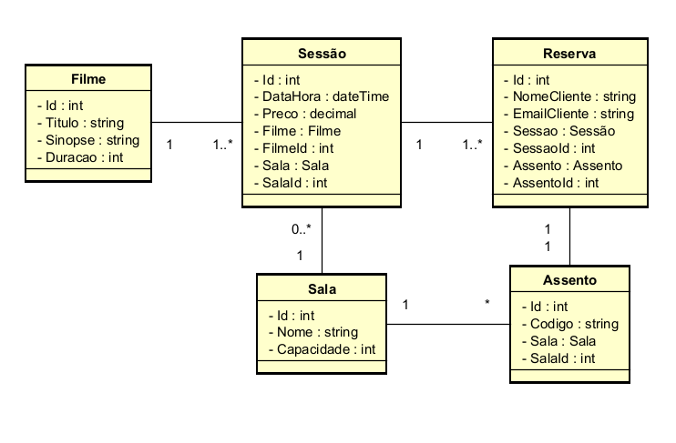

# Cinema API - Sistema Gerencial de Reservas

API RESTful desenvolvida como solução para o desafio técnico de gerenciamento de sessões de cinema e reservas de assentos.

**Deploy:** [Acessar Swagger no Render](https://cinema-api-bsze.onrender.com/swagger) _(O primeiro carregamento pode levar cerca de 50s devido ao plano gratuito)._

---

## O Desafio

O objetivo do projeto era desenvolver uma API para gerenciar reservas de assentos em sessões de cinema. O sistema deveria cumprir os seguintes requisitos funcionais, permitindo ao usuário:

- Gerenciar sessões de cinema.
- Listar sessões disponíveis.
- Consultar ocupação de assentos.
- Reservar assentos.

---

## Contexto e Decisões de Arquitetura

Após analisar os requisitos acima, foi realizado um alinhamento prévio via e-mail para refinar o escopo do projeto. Com a confirmação de que o sistema é voltado para um **contexto administrativo (Backoffice/Bilheteria - Gerente do Cinema)**, as seguintes decisões técnicas e de produto foram aplicadas:

- **Gestão Focada:** A API foi desenhada para a gestão de sessões, visualização de mapa de ocupação e registro interno de reservas, com endpoints adicionais de listagem de reservas para controle da gerência.
- **Pagamentos:** A etapa de cobrança foi intencionalmente deixada de fora (assumindo que ocorre no balcão físico ou em um microsserviço/gateway isolado).
- **YAGNI (You Aren't Gonna Need It):** O endpoint de _atualização_ de reservas (`PUT`) não foi implementado. Em sistemas reais de bilheteria, o padrão seguro e livre de problemas de concorrência para trocas de ingressos é o cancelamento (`DELETE`) seguido de uma nova emissão (`POST`).

---

## Tecnologias e Padrões Utilizados

A aplicação foi estruturada visando alto desacoplamento, manutenibilidade e aplicação dos princípios **SOLID**.

- **Linguagem/Framework:** C# com ASP.NET Core (.NET 10)
- **Banco de Dados:** SQLite (com Entity Framework Core)
- **Hospedagem:** Render (via Docker)
- **Padrões Implementados:**
  - **Clean Architecture (N-Tier):** Separação estrita entre `Controllers` (tráfego HTTP), `Services` (regras de negócio) e `Repositories` (acesso a dados).
  - **Repository Pattern:** Isolamento da camada de persistência, centralizando consultas e facilitando a criação de _mocks_ para testes.
  - **Dependency Injection:** Gerenciamento do ciclo de vida das classes coordenado pelo _container_ nativo do ASP.NET.
  - **Data Transfer Objects (DTOs):** Isolamento entre os contratos de API e as entidades do banco. O framework `Data Annotations` foi utilizado para barrar _payloads_ inválidos antes de atingirem a camada de serviço.
  - **RESTful Design:** Uso semântico e correto dos verbos HTTP e _status codes_ (ex: `201 Created` para inserções, `204 No Content` para atualizações/deleções bem-sucedidas).

---

## Modelagem de Dados

O banco de dados foi planejado e modelado antes da implementação para garantir a integridade e rastreabilidade dos relacionamentos.



---

## Regras de Negócio e Tratamento de Erros

O sistema conta com validações defensivas para garantir a consistência do banco de dados e evitar cenários de concorrência:

1. **Gestão de Conflitos de Horário:** A API calcula o fim da sessão com base na duração do filme e bloqueia cruzamentos de horário na mesma sala.
2. **Integridade Relacional:** Valida a existência prévia de Filme e Sala antes de cadastrar sessões, retornando respostas amigáveis (`400 Bad Request`) em vez de estourar exceções de banco de dados (`500`).
3. **Bloqueio Temporal:** Impede a criação de sessões no passado e veda o cancelamento de reservas vinculadas a sessões que já iniciaram.
4. **Prevenção de Duplicidade:** Trava anti-concorrência que bloqueia a reserva de um assento já ocupado.
5. **Proteção de Exclusão:** Impede que a administração exclua uma sessão caso ela já possua ingressos emitidos e ativos no banco.

---

## Como Executar o Projeto Localmente

O projeto é autocontido. Não é necessário instalar ou configurar servidores de banco de dados externos para testá-lo.

### Pré-requisitos

- [.NET 10 SDK](https://dotnet.microsoft.com/download/dotnet/10.0)

### Passos

1. Clone o repositório:

   ```bash
   git clone https://github.com/MLuizaFB/cinema-api.git
   ```

2. Acesse a pasta do projeto:

   ```bash
   cd cinema-api/CinemaApi
   ```

3. Execute a aplicação:

   ```bash
   dotnet run
   ```

A API será iniciada e o banco de dados `cinema.db` será gerado automaticamente dentro de CinemaApi.

Acesse a documentação no navegador: `http://localhost:5190/swagger/index.html`.

> **Nota (Seed de Dados):** Ao rodar a aplicação pela primeira vez, a classe genérica `DbInitializer` populará o banco automaticamente com 3 filmes (franquia Piratas do Caribe), 2 salas e as poltronas vinculadas, facilitando os testes imediatos.

## Estrutura de Endpoints

### 📽️ Sessões

- `GET /api/Sessoes` - Lista todas as sessões cadastradas.
- `GET /api/Sessoes/{id}/assentos` - Retorna o mapa de ocupação (ocupado: true/false) de todos os assentos daquela sessão.
- `POST /api/Sessoes` - Cria uma nova sessão.
- `PUT /api/Sessoes/{id}` - Atualiza os dados de uma sessão existente.
- `DELETE /api/Sessoes/{id}` - Exclui uma sessão (apenas se não houver reservas).

### 🎟️ Reservas

- `GET /api/Reservas` - Lista todas as reservas do sistema (Visão Gerencial).
- `POST /api/Reservas` - Efetua a reserva nominal de um assento.
- `DELETE /api/Reservas/{id}` - Cancela uma reserva existente.
